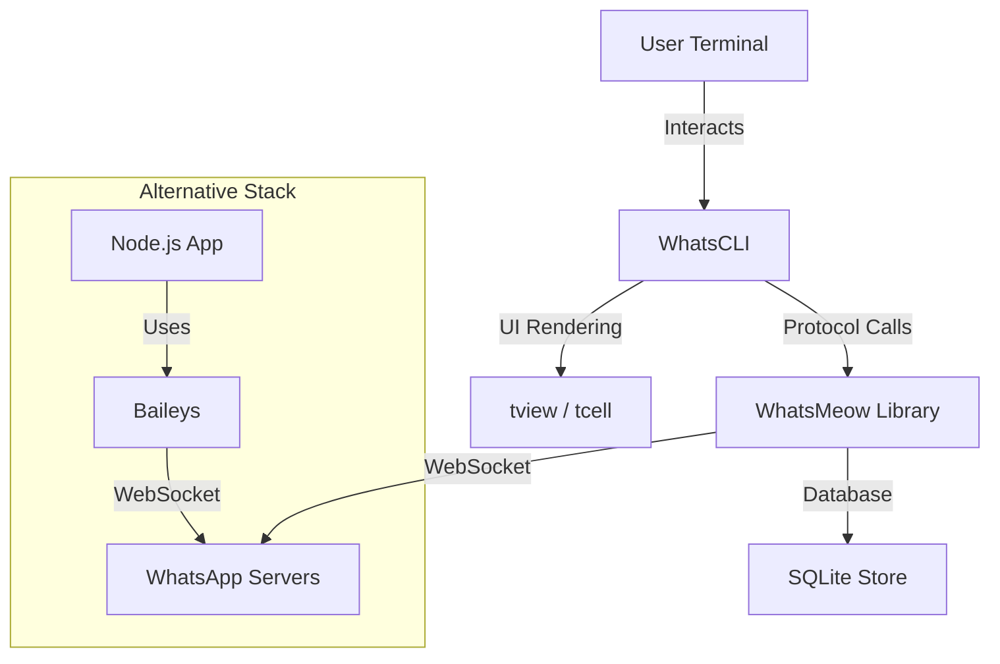

# WhatsApp Integration Analysis Report

## 1. Workspace Comprehension

### Architectural Overview

The workspace contains a specific stack interacting with the WhatsApp Multi-Device API.

*   **WhatsCLI (`github.com/normen/whatscli`)**:
    *   **Role**: A terminal-based user interface (TUI) client for WhatsApp.
    *   **Core Architecture**: built on `tview` and `tcell` for the UI. It delegates all protocol handling to `WhatsMeow`.
    *   **Entry Point**: `main.go` initializes the UI `app` and the `SessionManager`.
    *   **Integration**: It explicitly imports `go.mau.fi/whatsmeow` (via `go.mod`), but the workspace contains a *local copy* of `whatsmeow`. **Critical Note**: The `go.mod` in `WhatsCLI` does not appear to have a `replace` directive pointing to the local `whatsmeow` folder, meaning it might be building against a cached version rather than the local source code unless the go environment is configured otherwise (e.g. `gopls` workspace).

*   **WhatsMeow (`go.mau.fi/whatsmeow` - local copy)**:
    *   **Role**: The backend library implementing the WhatsApp Protocol (Noise, Signal, Protobufs).
    *   **Architecture**: Event-driven. It manages the socket connection, encryption, and state (store). It exposes channels (like `QRChannel`) and hooks (`AddEventHandler`) for consumers.
    *   **Key Dependencies**: Local `store` (SQLite), `binary/proto` (Protobuf definitions).

*   **Baileys (`@whiskeysockets/baileys`)**:
    *   **Role**: A Node.js equivalent of WhatsMeow. It's a complete library to interact with WhatsApp Web API.
    *   **Architecture**: Built on top of `ws` (WebSocket) and `pino` (logging), handling the same protocol layers.

### Architectural Diagram



---

## 2. WhatsCLI Deep Dive & QR Code Failure

### Authentication Flow Trace (`messages/session_manager.go`)

1.  **Initiation**: User runs `whatscli` or types `/connect`.
2.  **Handler**: `login()` (Line 165) calls `loginWithConnection()`.
3.  **Check Identity**: Checks `client.Store.ID`. If nil, it proceeds to pairing.
4.  **Pairing**: Calls `loginWithQRCode` (Line 239).
5.  **Channel Setup**: Calls `client.GetQRChannel` to get the channel.
6.  **Connection**: Calls `client.Connect()`.
7.  **Loop**: Iterates over `qrChan` to receive "code" events.
8.  **Output**: Uses a custom `qrcode` package to print the ASCII QR to the `textView`.

### Root Cause Analysis

**Primary Failure**: Concurrency Violation in UI Update.
In `messages/session_manager.go`:
```go
// Inside loginWithQRCode (running in 'runManager' goroutine)
252: terminal := qrcode.New()
253: terminal.SetOutput(tview.ANSIWriter(sm.uiHandler.GetWriter()))
254: terminal.Get(evt.Code).Print()
```
The `terminal.Print()` function writes data to the `tview.TextView` (via `ANSIWriter`). **However**, this code executes inside the `runManager` goroutine, *not* the main UI goroutine. `tview` is not thread-safe for direct writes. Writing to it from a background goroutine causes race conditions, undefined behavior, or simply the content not appearing until a refresh happens.

**Secondary Failure Risk**: Ignored Error Handling.
```go
243: qrChan, _ := client.GetQRChannel(context.Background())
```
The error return is ignored (`_`). If `GetQRChannel` returns an error (e.g., if the store thinks it's already logged in), `qrChan` will be `nil` (or closed/invalid). The code then proceeds to `client.Connect()` and then tries to range over `qrChan`. Ranging over a `nil` channel blocks forever (deadlock), causing the application to hang without showing anything.

### Rectification Plan

**Objective**: Ensure QR code printing happens on the UI thread and handle channel errors.

**Action 1: Fix Concurrency**
Modify `messages/session_manager.go` `loginWithQRCode` to wrap the print operation in `tview.Application.QueueUpdateDraw`.

**Action 2: Fix Error Handling**
Check the error from `GetQRChannel`.

**Code Patch (`messages/session_manager.go`):**

```go
func (sm *SessionManager) loginWithQRCode(client *whatsmeow.Client) error {
    sm.uiHandler.PrintText("Please scan the QR code with your phone")

    // Fix 1: Handle Error
    qrChan, err := client.GetQRChannel(context.Background())
    if err != nil {
        return fmt.Errorf("failed to get QR channel: %v", err)
    }

    err = client.Connect()
    if err != nil {
        return fmt.Errorf("error connecting to WhatsApp: %v", err)
    }

    for evt := range qrChan {
        if evt.Event == "code" {
            // Fix 2: Wrap UI update in QueueUpdateDraw
            // We need to access 'app' variable from main package or through uiHandler
            // Since uiHandler is an interface, we might need to expose a method or use the global 'app' if accessible, 
            // but cleaner is to use the existing PrintText mechanism if possible, 
            // or pass a closure to uiHandler.
            
            // Assuming we can't easily change the interfaces right now, 
            // and assuming 'app' is NOT global in this package (it's in main),
            // we should look at how uiHandler.PrintText is implemented -> it uses app.QueueUpdateDraw.
            
            // We can construct the string first, then print it using PrintText.
            
            terminal := qrcode.New()
            // We don't SetOutput to the writer directly. We get the string.
            // But the custom package only has Print(). 
            // We need to inspect `qrcode.go` again. 
            // It has Get(content), which returns *QRCodeString.
            // QRCodeString is `string`.
            
            qrString := terminal.Get(evt.Code) 
            
            // PrintText implementation in session_manager.go:
            // func (u UiHandler) PrintText(msg string) { PrintText(msg) } -> calls go app.QueueUpdateDraw
            
            sm.uiHandler.PrintText(string(*qrString)) 
            
        } else if evt.Event == "success" {
            // ... (rest remains same)
```

**Verification Steps**:
1.  Apply the fix.
2.  Run `whatscli`.
3.  Command `/connect` or `/login`.
4.  Verify that the QR code appears immediately.
5.  Verify that no "hang" occurs if the session is invalid (due to error check).

---

## 3. WhatsMeow vs Baileys Strategic Comparison

### Decision Matrix

| Feature | WhatsMeow (Go) | Baileys (Node.js) |
| :--- | :--- | :--- |
| **Performance** | **High**. Go's goroutines are lightweight. Handles high concurrency (many sessions) efficiently with lower memory footprint. | **Moderate**. Node.js single-threaded event loop. Good for I/O but can struggle with high CPU tasks (crypto) under massive load without clustering. |
| **Language Ecosystem** | **Go**. Statically typed, compiled. Great for backend services, CLIs, and high-reliability systems. Native binary deployment. | **Node.js/TypeScript**. Dynamic/Gradual typing. Massive ecosystem. Easier integration with web frontends or existing JS backends. |
| **Community & Support** | **Moderate/Niche**. Standard for Go, but smaller community than JS. | **Very High**. Widely used, many contributors, huge number of issues/guides available. |
| **Feature Completeness** | **High**. Very actively maintained by Tulir (Mautrix). Often implements new protocol features (like polls, edits) quickly. | **High**. Also very mature, but occasionally lags behind slightly on niche features or has stability regressions due to churn. |
| **Deployment** | **Single Binary**. Easy to deploy via Docker or just a binary. No `node_modules`. | **Runtime Dependent**. Requires Node environment, `node_modules` management. |
| **Debuggability** | **Excellent**. Go's pprof, race detector, and strict typing make deep protocol debugging easier. | **Good**. VS Code integration is great, but async stack traces in JS can be messy. |

### Recommendation

**Short-Term Direction**: **Stick with WhatsMeow**.
*   **Why**: You already have a working Go codebase (`WhatsCLI`). Switching to `Baileys` means rewriting the entire application logic. The specific bug identified is trivial to fix and does not reflect on the library's quality. WhatsMeow is robust and used in production-grade bridges (Mautrix).

**Long-Term Direction**:
*   **If building a SaaS/Web Service**: If your team is primarily JS/TS based and you need to integrate closely with a browser-based stack or React frontend, **Baileys** might offer faster iteration speed for your team.
*   **If building Infrastructure/Bots/CLI**: **WhatsMeow** is superior. The concurrency model of Go is better suited for maintaining stable long-lived socket connections for multiple users (if you ever scale). The compiled binary is easier to manage operationally.

**Conclusion**: Fix the WhatsCLI concurrency bug. Do not migrate to Baileys unless there is a compelling business reason to switch languages entirely.
